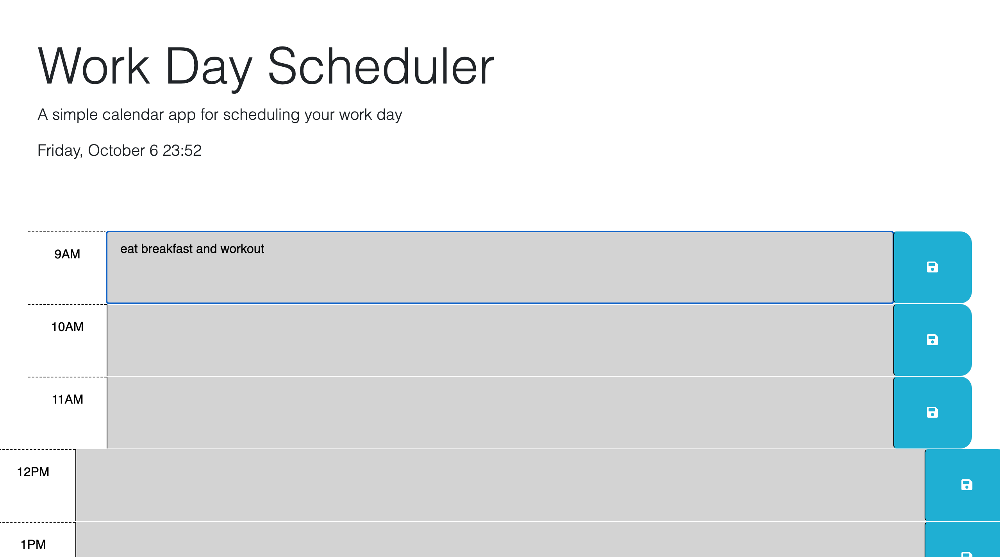

<!-- Improved compatibility of back to top link: See: https://github.com/othneildrew/Best-README-Template/pull/73 -->

[![Contributors][contributors-shield]][contributors-url]
[![Forks][forks-shield]][forks-url]
[![Stargazers][stars-shield]][stars-url]
[![Issues][issues-shield]][issues-url]

<h3 align="center">Work Day Scheduler</h3>

  

    This project is a simple Work Day Scheduler web application that allows users to plan and organize their workday by entering tasks or events into time-blocks corresponding to different hours of the day. 
     
    <a href="https://github.com/JackieChheng/WorkDayScheduler"><strong>Explore the docs »</strong></a>
     
     
    <a href="https://github.com/JackieChheng/WorkDayScheduler">View Demo</a>
    ·
    <a href="https://github.com/JackieChheng/WorkDayScheduler/issues">Report Bug</a>
    ·
    <a href="https://github.com/JackieChheng/WorkDayScheduler/issues">Request Feature</a>
  

<!-- TABLE OF CONTENTS -->

  
Table of Contents

  <ol>
    <li>
      <a href="#about-the-project">About The Project</a>
      <ul>
      </ul>
    </li>
    <li>
      <a href="#getting-started">Getting Started</a>
      <ul>
      </ul>
    </li>
    <li><a href="#usage">Usage</a></li>
    <li><a href="#roadmap">Roadmap</a></li>
    <li><a href="#contributing">Contributing</a></li>
    <li><a href="#license">License</a></li>
    <li><a href="#contact">Contact</a></li>
  </ol>

<!-- ABOUT THE PROJECT -->
## About The Project

This project is a simple Work Day Scheduler web application that allows users to plan and organize their workday by entering tasks or events into time-blocks corresponding to different hours of the day. 

(<a href="#readme-top">back to top</a>)

<!-- GETTING STARTED -->
## Getting Started

Just visit the page and type in what you would need to do from the time range from 9am to 5pm, the user data will store in local storage and it also uses Dayjs.

(<a href="#readme-top">back to top</a>)

<!-- USAGE EXAMPLES -->
## Usage

Users can use the scheduler to keep track of their daily tasks and appointments. They can enter tasks for each hour, making it easy to visualize and plan their day.

(<a href="#readme-top">back to top</a>)

<!-- ROADMAP -->
## Roadmap

- [x] Dayjs
- [x] LocalStorage
- [x] PreventDefault
    - [ ] More times 

See the [open issues](https://github.com/JackieChheng/WorkDayScheduler/issues) for a full list of proposed features (and known issues).

(<a href="#readme-top">back to top</a>)

<!-- CONTRIBUTING -->
## Contributing

Contributions are what make the open source community such an amazing place to learn, inspire, and create. Any contributions you make are **greatly appreciated**.

If you have a suggestion that would make this better, please fork the repo and create a pull request. You can also simply open an issue with the tag "enhancement".
Don't forget to give the project a star! Thanks again!

1. Fork the Project
2. Create your Feature Branch (`git checkout -b feature/AmazingFeature`)
3. Commit your Changes (`git commit -m 'Add some AmazingFeature'`)
4. Push to the Branch (`git push origin feature/AmazingFeature`)
5. Open a Pull Request

(<a href="#readme-top">back to top</a>)

<!-- LICENSE -->
## License

Distributed under the N/A License. See `LICENSE.txt` for more information.

(<a href="#readme-top">back to top</a>)

<!-- CONTACT -->
## Contact

Jackie Chheng - fake@gmail.com

Project Link: [https://github.com/JackieChheng/WorkDayScheduler](https://github.com/JackieChheng/WorkDayScheduler)

(<a href="#readme-top">back to top</a>)

<!-- MARKDOWN LINKS & IMAGES -->
<!-- https://www.markdownguide.org/basic-syntax/#reference-style-links -->
[contributors-shield]: https://img.shields.io/github/contributors/JackieChheng/WorkDayScheduler.svg?style=for-the-badge
[contributors-url]: https://github.com/JackieChheng/WorkDayScheduler/graphs/contributors
[forks-shield]: https://img.shields.io/github/forks/JackieChheng/WorkDayScheduler.svg?style=for-the-badge
[forks-url]: https://github.com/JackieChheng/WorkDayScheduler/network/members
[stars-shield]: https://img.shields.io/github/stars/JackieChheng/WorkDayScheduler.svg?style=for-the-badge
[stars-url]: https://github.com/JackieChheng/WorkDayScheduler/stargazers
[issues-shield]: https://img.shields.io/github/issues/JackieChheng/WorkDayScheduler.svg?style=for-the-badge
[issues-url]: https://github.com/JackieChheng/WorkDayScheduler/issues
[license-shield]: https://img.shields.io/github/license/JackieChheng/WorkDayScheduler.svg?style=for-the-badge
[license-url]: https://github.com/JackieChheng/WorkDayScheduler/blob/master/LICENSE.txt
[linkedin-shield]: https://img.shields.io/badge/-LinkedIn-black.svg?style=for-the-badge&logo=linkedin&colorB=555
